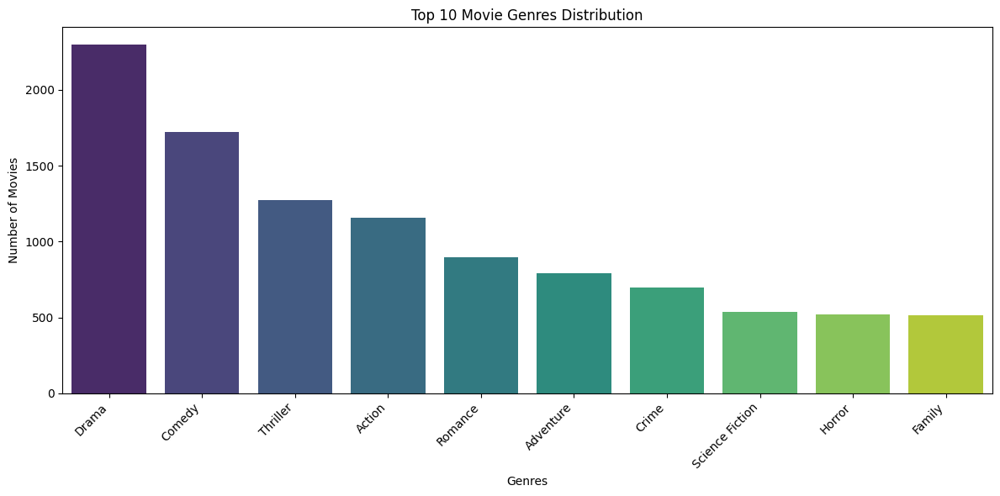
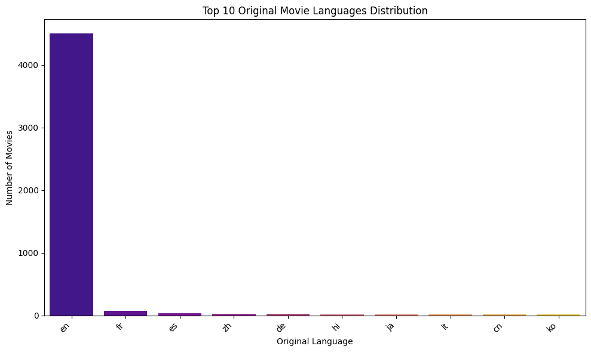
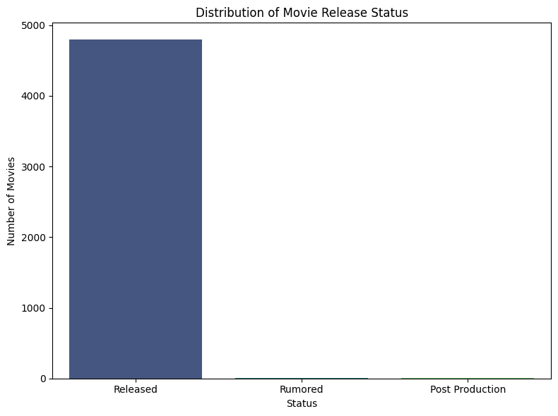
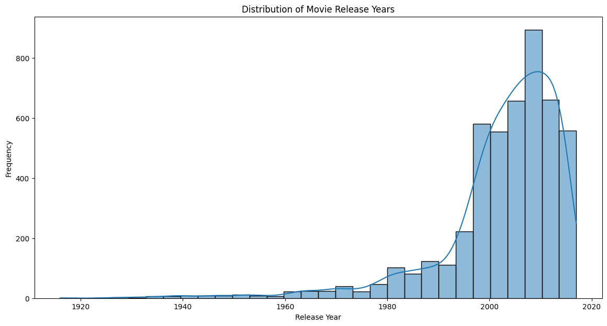
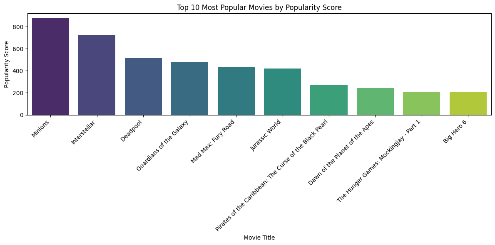
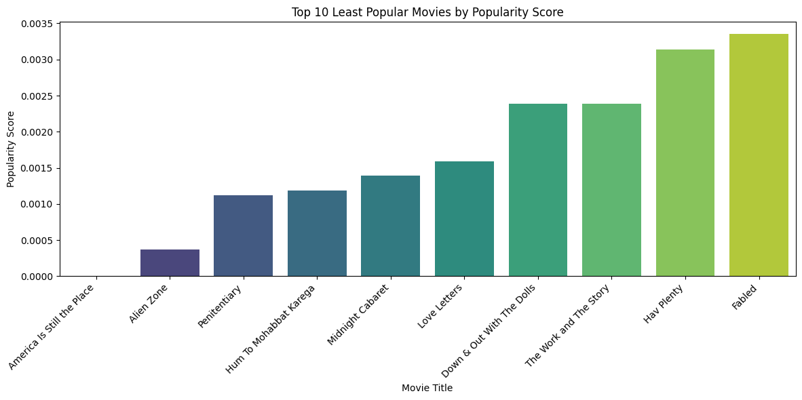
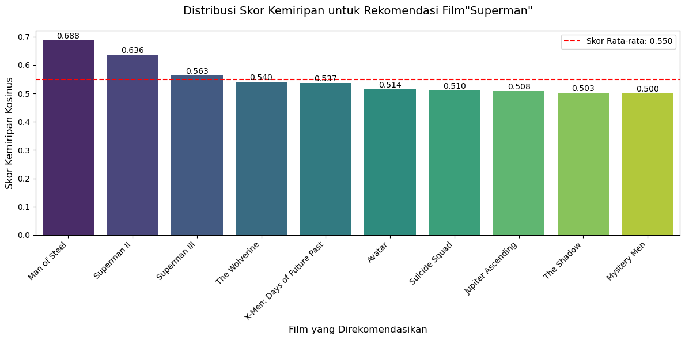

# Laporan Proyek Machine Learning - Johanadi Santoso


## Project Overview

Sistem rekomendasi film telah menjadi elemen kunci dalam meningkatkan pengalaman pengguna di platform streaming seperti Netflix, Hulu, dan Amazon Prime. Dengan jumlah film yang terus bertambah, pengguna sering kali merasa kewalahan dalam memilih konten yang sesuai dengan selera mereka. Proyek ini bertujuan untuk mengembangkan sistem rekomendasi berbasis konten yang memanfaatkan metadata film dari *The Movie Database (TMDB)*, yang mencakup informasi seperti genre, kata kunci, pemeran, dan sinopsis. Dataset ini diunduh dari Kaggle dan digunakan untuk membangun model yang dapat merekomendasikan film serupa berdasarkan film yang dipilih pengguna.

Pentingnya proyek ini terletak pada kemampuannya untuk meningkatkan kepuasan pengguna dan *engagement* di platform streaming. Menurut penelitian oleh Lops et al., sistem rekomendasi berbasis konten efektif dalam memberikan rekomendasi yang transparan dan relevan karena memanfaatkan fitur intrinsik dari item itu sendiri [1]. Selain itu, pendekatan ini memungkinkan personalisasi tanpa memerlukan data historis pengguna dalam jumlah besar, yang sering kali menjadi kendala dalam pendekatan berbasis kolaboratif [2]. Dengan demikian, proyek ini tidak hanya memiliki nilai praktis dalam industri hiburan tetapi juga berkontribusi pada pengembangan teknologi rekomendasi yang lebih inklusif.

## Referensi

> [1] P. Lops, M. de Gemmis, and G. Semeraro, "Content-based Recommender Systems: State of the Art and Trends," in *Recommender Systems Handbook*, Springer, 2011, pp. 73-105. [Online]. Available: https://doi.org/10.1007/978-0-387-85820-3_3  
   [2] F. Ricci, L. Rokach, and B. Shapira, "Introduction to Recommender Systems Handbook," in *Recommender Systems Handbook*, Springer, 2011, pp. 1-35.  
   [3] The Movie Database (TMDB) Movie Metadata. [Online]. Available: https://www.kaggle.com/datasets/tmdb/tmdb-movie-metadata  

---
## Business Understanding
Dalam konteks platform streaming modern, kemampuan untuk menyediakan rekomendasi yang relevan menjadi salah satu faktor kunci dalam menjaga retensi pengguna. Tantangan utama yang dihadapi adalah bagaimana membantu pengguna menemukan film yang sesuai di tengah banyaknya pilihan yang tersedia. Jika tidak ada sistem rekomendasi yang efektif, pengguna berisiko merasa kewalahan atau kehilangan ketertarikan untuk terus menjelajahi konten di platform ini. Karena itu, merancang sistem rekomendasi yang mampu mengenali preferensi masing-masing pengguna menjadi kunci penting untuk memastikan pengalaman pengguna tetap menyenangkan.

### Problem Statements
1. **Kesulitan Menemukan Konten Relevan**: Pengguna sering kali kesulitan menemukan film yang sesuai dengan minat mereka karena volume konten yang besar.
2. **Decision Fatigue**: Banyaknya pilihan menyebabkan pengguna merasa kewalahan, yang dapat mengurangi kepuasan mereka terhadap platform.
3. **Keterbatasan Pencarian Konvensional**: Fitur pencarian tradisional tidak cukup untuk memahami preferensi individu secara mendalam.

### Goals
1. **Meningkatkan Penemuan Konten**: Menyediakan rekomendasi film yang relevan untuk mempermudah pengguna menemukan konten yang sesuai.
2. **Mengurangi Waktu Pencarian**: Meminimalkan waktu yang dibutuhkan pengguna untuk menemukan film yang diinginkan.
3. **Meningkatkan Engagement**: Meningkatkan keterlibatan pengguna melalui rekomendasi yang sesuai dengan selera mereka.

### Solution Approach
Solusi yang diusulkan adalah sistem rekomendasi berbasis *content-based filtering*. Metode ini menitikberatkan pada analisis atribut dari konten itu sendiri, seperti genre, deskripsi, dan kata kunci yang terkait. Sistem mempelajari film atau acara yang telah ditonton untuk memberikan rekomendasi berdasarkan kemiripan karakteristik kontennya.

#### *Ekstraksi Fitur*:

* Sistem menggunakan berbagai atribut film, seperti genre, judul, dan deskripsi, untuk memahami isi dari setiap film.
* Film dengan karakteristik serupa dengan yang pernah ditonton atau diberi penilaian tinggi oleh pengguna akan diprioritaskan untuk direkomendasikan.

#### *Pengukuran Kemiripan*:

* Tingkat kesamaan antar film dihitung dengan teknik seperti **cosine similarity** atau metode pengukuran jarak lainnya, menggunakan fitur-fitur yang telah diperoleh sebelumnya.

#### *Pemberian Rekomendasi*:

* Film akan diurutkan berdasarkan tingkat kemiripan, dan sistem akan merekomendasikan film yang paling mirip dengan preferensi pengguna sebelumnya.
* Fokus utama pendekatan ini adalah karakteristik konten, sehingga rekomendasi dihasilkan dari analisis kesamaan konten yang pernah disukai atau ditonton oleh pengguna.

#### *Evaluasi Kinerja*:

* **Precision**: Mengukur proporsi item relevan di antara seluruh item yang direkomendasikan.
* **Recall**: Mengukur proporsi item relevan yang berhasil direkomendasikan dibandingkan total item relevan yang tersedia.
* **F1-Score**: Merupakan rata-rata harmonik dari precision dan recall, digunakan untuk menyeimbangkan keduanya dalam evaluasi performa sistem.


---

## Data Understanding

### **Pengumpulan Data**
Proyek ini menggunakan dataset *TMDB Movie Metadata* yang tersedia di [Kaggle](https://www.kaggle.com/datasets/tmdb/tmdb-movie-metadata) [3] . Dataset ini terdiri dari dua file utama:
- **`tmdb_5000_credits.csv`**: Berisi informasi tentang pemeran dan kru film terdiri dari 4 kolom dan 4803 baris.
- **`tmdb_5000_movies.csv`**: Berisi metadata film seperti judul, genre, kata kunci, dan sinopsis. Dataset ini terdiri dari 20 kolom dan 4803 baris.


#### Daftar Lengkap Variabel/Fitur 

➡️ Berikut adalah metadata lengkap yang tersedia dalam dataset **tmdb_5000_credits**:

| No  | Kolom                | Tipe Data | Non-Null Count | Deskripsi                          | Contoh Data                                                        |
| --- | -------------------- | --------- | -------------- | ---------------------------------- | ------------------------------------------------------------------ |
| 1   | movie_id             | int64     | 4803           | ID unik film di TMDB               | 19995                                                              |
| 2   | title                | object    | 4803           | Judul film                         | "Avatar"                                                           |
| 3   | cast                 | object    | 4803           | Daftar pemeran film (dalam JSON)   | `[{"cast_id": 242, "character": "Jake Sully",  "gender": 2, "...}]`|
| 4   | crew                 | object    | 4803           | Daftar kru film dalam format JSON  | `[{"department": "Editing", "gender": 0, "id": 1721, "job": ... }]`|


➡️ Berikut adalah metadata lengkap yang tersedia dalam dataset **tmdb_5000_movies**:
| No  | Kolom                | Tipe Data | Non-Null Count | Deskripsi                          | Contoh Data                                                        |
| --- | -------------------- | --------- | -------------- | ---------------------------------- | ------------------------------------------------------------------ |
| 1   | budget               | int64     | 4803           | Anggaran produksi film (dalam USD) | 237000000                                                          |
| 2   | genres               | object    | 4803           | Daftar genre dalam format JSON     | `[{"id":28,"name":"Action"},{"id":12,"name":"Adventure"}]`         |
| 3   | homepage             | object    | 1712           | URL website resmi film             | "http://www.avatarmovie.com/"                                      |
| 4   | id                   | int64     | 4803           | ID unik film di TMDB               | 19995                                                              |
| 5   | keywords             | object    | 4803           | Kata kunci terkait film (JSON)     | `[{"id":1463,"name":"culture clash"},{"id":2968,"name":"future"}]` |
| 6   | original_language    | object    | 4803           | Bahasa asli film (kode ISO)        | "en"                                                               |
| 7   | original_title       | object    | 4803           | Judul asli film                    | "Avatar"                                                           |
| 8   | overview             | object    | 4800           | Sinopsis/ringkasan cerita          | "In the 22nd century, a paraplegic Marine..."                      |
| 9   | popularity           | float64   | 4803           | Skor popularitas TMDB              | 150.437577                                                         |
| 10  | production_companies | object    | 4803           | Perusahaan produksi (JSON)         | `[{"name":"Ingenious Film Partners","id":289}]`                    |
| 11  | production_countries | object    | 4803           | Negara produksi (JSON)             | `[{"iso_3166_1":"US","name":"United States"}]`                     |
| 12  | release_date         | object    | 4802           | Tanggal rilis (YYYY-MM-DD)         | "2009-12-10"                                                       |
| 13  | revenue              | int64     | 4803           | Pendapatan kotor (USD)             | 2787965087                                                         |
| 14  | runtime              | float64   | 4801           | Durasi film (menit)                | 162.0                                                              |
| 15  | spoken_languages     | object    | 4803           | Bahasa yang digunakan (JSON)       | `[{"iso_639_1":"en","name":"English"}]`                            |
| 16  | status               | object    | 4803           | Status rilis                       | "Released"                                                         |
| 17  | tagline              | object    | 3959           | Slogan film                        | "Enter the World of Pandora."                                      |
| 18  | title                | object    | 4803           | Judul film                         | "Avatar"                                                           |
| 19  | vote_average         | float64   | 4803           | Rating rata-rata (0-10)            | 7.2                                                                |
| 20  | vote_count           | int64     | 4803           | Jumlah vote                        | 11800                                                              |


### Kualitas Data
- **Nilai Hilang**: Kolom `overview` dan `tagline` memiliki beberapa nilai yang hilang, yang akan ditangani pada tahap persiapan data.
- **Duplikasi**: Tidak ada duplikasi signifikan berdasarkan `movie_id` atau `title`.
- **Format JSON**: Kolom seperti `genres`, `keywords`, dan `cast` memerlukan parsing untuk digunakan dalam analisis.


### **Exploratory Data Analysis (EDA)**

Exploratory Data Analysis (EDA) merupakan langkah penting dalam memahami karakteristik dataset TMDB sebelum melangkah ke tahap pemodelan untuk sistem rekomendasi. Tujuan utama EDA adalah mengidentifikasi pola, anomali, distribusi, dan hubungan antar variabel yang dapat memengaruhi hasil analisis atau rekomendasi. Dalam bagian ini, kita akan mengeksplorasi beberapa aspek kunci dari dataset, yaitu distribusi genre film, tahun rilis, bahasa, status rilis, Popularitas 10 Film teratas dan terbawah .Setiap sub-bagian akan dilengkapi dengan kode, visualisasi, dan Insight.

#### **Distribusi Genre Film**

- **Tujuan**: Analisis ini bertujuan untuk melihat genre yang paling dominan dalam dataset.

- **Visualisasi**: 




- **Insight**:

   1. **Genre Drama Mendominasi:** Genre drama memiliki jumlah film yang jauh lebih banyak dibandingkan genre lainnya, dengan lebih dari 2250 film. Ini menunjukkan popularitas atau produksi yang tinggi untuk film bergenre drama.

   2. **Comedy dan Thriller Menyusul:** Setelah drama, genre komedi dan thriller menempati posisi berikutnya dengan jumlah film yang signifikan, masing-masing di atas 1700 dan 1250 film.

   3. **Penurunan Jumlah Film:** Terlihat tren penurunan jumlah film secara bertahap dari genre drama hingga family. Hal ini mengindikasikan bahwa genre-genre di urutan atas lebih banyak diproduksi atau tersedia dibandingkan dengan genre-genre di urutan bawah.

   4. **Perbedaan Signifikan:** Perbedaan jumlah film antara beberapa genre cukup besar. Contohnya, selisih antara drama dan komedi lebih dari 500 film, sementara selisih antara horror dan family relatif kecil.

   5. **Genre dengan Jumlah Sedikit:** Genre seperti science fiction, horror, dan family memiliki jumlah film yang relatif lebih sedikit dibandingkan genre-genre populer seperti drama, komedi, dan thriller.


#### **Visualisasi Distribusi Bahasa Menggunakan Diagram Batang**
- **Tujuan**: Memahami bahasa yang paling dominan dalam dataset film.
- **Visualisasi**:

   

- **Insight**: 
   1. **Bahasa Inggris Dominan**
      Bahasa Inggris ("en") sangat mendominasi dengan lebih dari 4.500 film, jauh di atas bahasa lain.

   2. **Bahasa Lain Tertinggal Jauh**
      Bahasa seperti Prancis, Spanyol, Mandarin, Hindi, dan lainnya masing-masing hanya menyumbang sebagian kecil (kurang dari 150 film).

   3. **Distribusi Tidak Merata**
      Industri film global sangat terpusat pada produksi berbahasa Inggris.

   4. **Peluang untuk Bahasa Lokal**
      Kehadiran bahasa Asia seperti Hindi, Mandarin, dan Korea menunjukkan potensi pertumbuhan jika didukung distribusi yang baik.


#### **Visualisasi Distribusi Status Rilis Film Menggunakan Bar Chart**
- **Tujuan**: Mengetahui distribusi status rilis film (misalnya, Released, Post Production, dll.).
- **Visualisasi**: 

   

- **Insight**:
   Berikut insight ringkas dari grafik distribusi status rilis film:

   1. **Mayoritas Film Sudah Dirilis**
      Sebagian besar film (hampir 5.000) berstatus "Released".

   2. **Jumlah Film yang Belum Dirilis Sangat Sedikit**
      Film dengan status "Rumored" dan "Post Production" jumlahnya sangat kecil dibandingkan yang sudah dirilis.

   3. **Fokus Data pada Film yang Telah Tayang**
      Dataset ini sangat terpusat pada film yang telah dirilis, sehingga cocok untuk analisis performa atau tren film yang sudah tersedia di pasar.

---

#### **Visualisasi Distribusi Tahun Rilis Film**
- **Tujuan**: Menunjukkan sebaran film berdasarkan tahun rilis.
- **Visualisasi**: 

   

- **Insight**: 
   Berikut insight ringkas dari grafik dan statistik distribusi tahun rilis film:
   1. **Mayoritas Film Dirilis Setelah Tahun 2000**
      Dengan nilai median tahun rilis adalah **2005**, serta 75% film dirilis setelah **1999**, terlihat bahwa mayoritas film dalam dataset merupakan produksi **modern**.

   2. **Peningkatan Produksi Sejak 1970-an**
      Terjadi lonjakan produksi film sejak era 1970-an, yang terus meningkat hingga mencapai puncaknya pada **2005–2015**.

   3. **Dominasi Film Era 2000-an**
      Nilai **rata-rata (mean)** tahun rilis adalah **2002**, yang menunjukkan dominasi film dari dua dekade terakhir dalam dataset ini.

   4. **Distribusi Kurang Merata Sebelum 1980**
      Nilai **minimum** adalah tahun **1916**, namun hanya sebagian kecil film yang dirilis sebelum **1980**, mencerminkan perkembangan industri film yang masih terbatas pada periode tersebut.

   5. **Penurunan Setelah Tahun 2015**
      Penurunan tajam pada jumlah film rilis setelah **2015** dapat disebabkan oleh keterbatasan data terbaru atau gangguan industri seperti pandemi.

---

#### **Visualisasi Popularitas 10 Film Teratas**
- **Tujuan**: Mengidentifikasi film yang paling populer dalam dataset.
- **Visualisasi**: 

   

- **Insight**: 
   1. **Minions Merajai Popularitas**
      Film *Minions* menempati posisi teratas dengan skor popularitas tertinggi, melampaui film-film lain secara signifikan.

   2. **Dominasi Film Blockbuster**
      Film-film populer seperti *Interstellar*, *Deadpool*, *Guardians of the Galaxy*, dan *Jurassic World* termasuk dalam daftar, menunjukkan bahwa **film dengan skala produksi besar dan cakupan global cenderung memiliki skor popularitas tinggi**.

   3. **Franchise dan Film Aksi/Fantasi Mendominasi**
      Sebagian besar film dalam daftar ini merupakan bagian dari franchise besar atau bergenre aksi/sci-fi/fantasi, yang biasanya memiliki basis penggemar luas dan dukungan promosi besar-besaran.

   4. **Distribusi Popularitas Turun Signifikan**
      Setelah posisi ke-2, skor popularitas mengalami penurunan bertahap namun signifikan, dengan perbedaan hampir 700 poin antara film pertama (*Minions*) dan ke-10 (*Big Hero 6*), menunjukkan **skala kesenjangan popularitas yang besar di antara film-film top**.


---

#### **Visualisasi Popularitas 10 Film Terendah**
- **Tujuan**: Mengidentifikasi film yang kurang populer dalam dataset.
- **Visualisasi**:

   

- **Insight**:
   1. **Film Kurang Dikenal Mendominasi Daftar**
      Judul-judul seperti *America Is Still the Place*, *Alien Zone*, dan *Penitentiary* kemungkinan besar kurang dikenal atau memiliki distribusi terbatas, yang berkontribusi pada skor popularitas yang sangat rendah.

   2. **Skor Popularitas Sangat Rendah dan Merata**
      Nilai popularitas pada daftar ini sangat kecil, dengan kisaran di bawah 0.0035. Ini menandakan **minimnya eksposur publik terhadap film-film ini**, baik dari sisi penayangan, promosi, maupun pencarian daring.

   3. **Potensi Film Independen atau Niche**
      Judul-judul ini berpotensi merupakan film indie, dokumenter lokal, atau rilisan terbatas yang tidak menyasar pasar massal, sehingga secara alami memperoleh skor popularitas yang lebih rendah.

   4. **Perbedaan Jarak Sangat Tajam dengan Film Paling Populer**
      Dibandingkan dengan film terpopuler seperti *Minions* (dengan skor >800), **film-film ini memiliki skor yang nyaris mendekati nol**, menunjukkan **kontras ekstrem dalam jangkauan audiens dan penerimaan publik**.

      
---

## Data Preparation
Tahap ini melibatkan pembersihan dan transformasi data agar siap digunakan dalam pemodelan. Proses ini sangat penting untuk memastikan bahwa data yang digunakan dalam model adalah bersih, konsisten, dan relevan.

### Data Preprocessing
Berikut adalah langkah-langkah rinci yang dilakukan dalam proses *data preprocessing*, beserta alasan, metode, dan dampaknya terhadap kualitas data:

#### 1. Penggabungan Dataset
- **Deskripsi**: Dataset `tmdb_5000_movies.csv` dan `tmdb_5000_credits.csv` digabungkan menjadi satu DataFrame tunggal.
- **Alasan**:  
  - Dataset awal terpisah tidak memungkinkan analisis holistik. Penggabungan ini mengintegrasikan informasi metadata film (seperti genre dan popularitas) dengan data pemeran (cast) untuk menciptakan representasi yang lebih lengkap dari setiap film.
  - Informasi pemeran dapat menjadi fitur penting dalam sistem rekomendasi berbasis konten, karena pengguna sering kali menyukai film dengan aktor tertentu.
- **Metode**:  
  - Menggunakan fungsi `pd.merge()` dari library Pandas dengan parameter `on='movie_id'` dan `how='inner'` untuk memastikan hanya film dengan ID yang cocok yang disertakan.
  - Contoh kode:
    ```python
    import pandas as pd
    movies = pd.read_csv('tmdb_5000_movies.csv')
    credits = pd.read_csv('tmdb_5000_credits.csv')
    df = pd.merge(movies, credits, on='movie_id', how='inner')
    ```
- **Dampak**: Dataset yang dihasilkan memiliki 4.803 baris dan semua kolom dari kedua file, memberikan informasi yang lebih kaya untuk analisis dan pemodelan.

#### 2. Pemeriksaan dan Penanganan Duplikasi
- **Deskripsi**: Memeriksa apakah ada duplikat berdasarkan `movie_id` dan `title`.
- **Alasan**:  
  - Duplikasi dapat menyebabkan bias dalam analisis dan pemodelan, seperti over-representasi film tertentu dalam rekomendasi.
  - Memastikan setiap film hanya muncul sekali meningkatkan integritas data.
- **Metode**:  
  - Menggunakan `df.duplicated(subset=['movie_id']).sum()` untuk mendeteksi duplikat berdasarkan `movie_id`.
  - Menggunakan `df.drop_duplicates(subset=['movie_id'], keep='first')` jika duplikat ditemukan.
- **Hasil**: Tidak ada duplikat yang signifikan dalam dataset ini, sehingga tidak ada data yang dihapus.
- **Dampak**: Data tetap konsisten dan bebas dari redundansi.

#### 3. Penanganan Nilai Hilang
- **Deskripsi**: Mengidentifikasi dan menangani nilai hilang pada kolom `overview` dan `tagline`.
- **Alasan**:  
  - Nilai hilang pada kolom teks dapat menyebabkan error saat pemrosesan teks atau hilangnya informasi penting dalam ekstraksi fitur.
  - Mengisi nilai hilang dengan string kosong memungkinkan pemrosesan tanpa kehilangan baris data.
- **Metode**:  
  - Menggunakan `df['overview'].fillna('')` dan `df['tagline'].fillna('')` untuk mengganti nilai `NaN` dengan string kosong.
  - Contoh kode:
    ```python
    df['overview'] = df['overview'].fillna('')
    df['tagline'] = df['tagline'].fillna('')
    ```
- **Hasil**: Sebanyak 3 nilai hilang pada `overview` dan 128 nilai hilang pada `tagline` berhasil ditangani.
- **Dampak**: Semua baris data tetap dipertahankan, dan kolom teks dapat diproses tanpa error.

#### 4. Parsing Data JSON
- **Deskripsi**: Mengubah kolom JSON (`genres`, `keywords`, `cast`) menjadi daftar string yang dapat digunakan.
- **Alasan**:  
  - Data dalam format JSON tidak dapat langsung digunakan untuk analisis atau pemodelan; perlu diekstrak menjadi format yang lebih sederhana.
  - Mengekstrak nama genre, kata kunci, dan pemeran memungkinkan penggunaannya sebagai fitur dalam sistem rekomendasi.
- **Metode**:  
  - Menggunakan `json.loads()` untuk mengurai string JSON, diikuti dengan fungsi kustom untuk mengekstrak hanya nama-nama yang relevan.
  - Membatasi `cast` hingga 5 pemeran utama untuk mengurangi kompleksitas.
  - Contoh kode:
    ```python
    import json
    def parse_json(data):
        if pd.isna(data):
            return []
        return [item['name'] for item in json.loads(data)]
    
    df['genres'] = df['genres'].apply(parse_json)
    df['keywords'] = df['keywords'].apply(parse_json)
    df['cast'] = df['cast'].apply(lambda x: parse_json(x)[:5])
    ```
- **Hasil**: Kolom `genres`, `keywords`, dan `cast` kini berisi daftar string (contoh: `['Action', 'Adventure']`).
- **Dampak**: Data JSON yang terstruktur menjadi fitur yang dapat dimanfaatkan untuk analisis dan pemodelan.

#### 5. Pembersihan Teks
- **Deskripsi**: Membersihkan teks pada kolom `overview` dan `tagline` dengan menghapus karakter khusus, mengubah ke huruf kecil, dan menghapus *stopwords*.
- **Alasan**:  
  - Karakter khusus dan kapitalisasi yang tidak konsisten dapat mengganggu proses vektorisasi teks.
  - Menghapus *stopwords* (kata umum seperti "the", "and") meningkatkan fokus pada kata-kata yang bermakna.
- **Metode**:  
  - Menggunakan library `re` untuk pembersihan dan `nltk` untuk *stopwords*.
  - Contoh kode:
    ```python
    import re
    from nltk.corpus import stopwords
    stop_words = set(stopwords.words('english'))
    
    def clean_text(text):
        text = re.sub(r'[^a-zA-Z\s]', '', text.lower())
        return ' '.join([word for word in text.split() if word not in stop_words])
    
    df['overview'] = df['overview'].apply(clean_text)
    df['tagline'] = df['tagline'].apply(clean_text)
    ```
- **Hasil**: Teks menjadi lebih bersih dan terstandarisasi (contoh: "The Dark Knight Rises" → "dark knight rises").
- **Dampak**: Meningkatkan kualitas vektorisasi teks dan relevansi fitur yang dihasilkan.

#### 6. Kombinasi Fitur Teks
- **Deskripsi**: Menggabungkan kolom `overview`, `tagline`, `genres`, `keywords`, dan `cast` menjadi satu kolom teks tunggal (`combined_features`).
- **Alasan**:  
  - Menggabungkan semua fitur teks memberikan representasi yang lebih komprehensif dari setiap film.
  - Memungkinkan sistem rekomendasi untuk mempertimbangkan semua aspek konten secara bersamaan.
- **Metode**:  
  - Menggunakan operasi string concatenation dengan spasi sebagai pemisah.
  - Contoh kode:
    ```python
    df['combined_features'] = (df['overview'] + ' ' + 
                               df['tagline'] + ' ' + 
                               df['genres'].apply(' '.join) + ' ' + 
                               df['keywords'].apply(' '.join) + ' ' + 
                               df['cast'].apply(' '.join))
    ```
- **Hasil**: Kolom baru berisi teks gabungan (contoh: "dark knight rises action crime drama batman christian bale").
- **Dampak**: Representasi teks yang kaya untuk setiap film, siap untuk vektorisasi.

#### 7. TF-IDF Vectorization
- **Deskripsi**: Mengubah kolom `combined_features` menjadi matriks TF-IDF.
- **Alasan**:  
  - TF-IDF (*Term Frequency-Inverse Document Frequency*) mengonversi teks menjadi representasi numerik yang menekankan kata-kata unik dan relevan.
  - Mengurangi bobot kata-kata umum dan meningkatkan bobot kata-kata spesifik, sehingga meningkatkan kualitas rekomendasi.
- **Metode**:  
  - Menggunakan `TfidfVectorizer` dari Scikit-learn dengan parameter `stop_words='english'` dan `max_features=5000` untuk membatasi dimensi.
  - Contoh kode:
    ```python
    from sklearn.feature_extraction.text import TfidfVectorizer
    tfidf = TfidfVectorizer(stop_words='english', max_features=5000)
    tfidf_matrix = tfidf.fit_transform(df['combined_features'])
    ```
- **Hasil**: Matriks sparse dengan ukuran (4803, 5000), mewakili 4.803 film dan 5.000 fitur TF-IDF.
- **Dampak**: Data teks kini dalam format numerik yang dapat digunakan untuk perhitungan kemiripan.

#### 8. Normalisasi Fitur Numerik
- **Deskripsi**: Menormalisasi kolom `popularity` ke skala 0-1.
- **Alasan**:  
  - Skala `popularity` yang bervariasi luas (0 hingga >1000) dapat mendominasi fitur teks jika tidak dinormalisasi.
  - Normalisasi memastikan semua fitur memiliki kontribusi yang seimbang dalam perhitungan kemiripan.
- **Metode**:  
  - Menggunakan `MinMaxScaler` dari Scikit-learn.
  - Contoh kode:
    ```python
    from sklearn.preprocessing import MinMaxScaler
    scaler = MinMaxScaler()
    popularity_scaled = scaler.fit_transform(df[['popularity']])
    ```
- **Hasil**: Nilai `popularity` kini berada dalam rentang 0-1.
- **Dampak**: Fitur numerik siap digabungkan dengan matriks TF-IDF tanpa bias skala.

#### 9. Penggabungan Matriks Fitur
- **Deskripsi**: Menggabungkan matriks TF-IDF dengan fitur `popularity` yang dinormalisasi.
- **Alasan**:  
  - Mengintegrasikan informasi teks dan numerik untuk menciptakan representasi fitur yang lengkap.
  - Memungkinkan sistem rekomendasi mempertimbangkan popularitas sebagai faktor tambahan.
- **Metode**:  
  - Menggunakan `hstack` dari `scipy.sparse` untuk menggabungkan matriks sparse dan array numerik.
  - Contoh kode:
    ```python
    from scipy.sparse import hstack
    final_matrix = hstack([tfidf_matrix, popularity_scaled])
    ```
- **Hasil**: Matriks fitur akhir dengan ukuran (4803, 5001).
- **Dampak**: Data siap untuk perhitungan *cosine similarity* dalam tahap pemodelan.

### Ringkasan Data Preprocessing
- **Langkah Utama**: Penggabungan dataset, penanganan nilai hilang, parsing JSON, pembersihan teks, kombinasi fitur, TF-IDF, normalisasi, dan penggabungan matriks.
- **Hasil Akhir**: Matriks fitur yang bersih, konsisten, dan representatif untuk setiap film.
- **Implikasi Bisnis**: Data yang telah diproses meningkatkan akurasi rekomendasi, yang pada akhirnya mendukung tujuan proyek untuk meningkatkan penemuan konten dan kepuasan pengguna.

---

## Modeling and Results
Bagian ini menjelaskan secara mendalam proses pembangunan model sistem rekomendasi berbasis *content-based filtering*, termasuk langkah-langkah pemodelan, parameter yang digunakan, hasil rekomendasi, evaluasi, dan visualisasi yang mendukung.

### Pendekatan Content-Based Filtering
*Content-based filtering* merekomendasikan film berdasarkan kesamaan konten dengan film referensi. Fitur yang digunakan meliputi teks (genre, kata kunci, pemeran, overview, tagline) dan numerik (popularitas).

#### 1. Ekstraksi Fitur
- **Fitur Teks**:
  - **Proses**: Kolom `combined_features` diubah menjadi matriks TF-IDF menggunakan `TfidfVectorizer` dari Scikit-learn.
  - **Parameter**:
    - `stop_words='english'`: Menghapus kata umum seperti "the", "and".
    - `max_features=5000`: Membatasi dimensi untuk efisiensi komputasi.
    - `min_df=3`: Mengabaikan kata yang muncul di kurang dari 3 film untuk mengurangi noise.
  - **Alasan Pemilihan Parameter**:
    - `stop_words` meningkatkan fokus pada kata bermakna.
    - `max_features` menyeimbangkan antara representasi fitur dan performa.
    - `min_df` memfilter kata yang terlalu jarang, yang cenderung tidak relevan.
  - **Hasil**: Matriks sparse (4803, 5000) yang mewakili fitur teks setiap film.
- **Fitur Numerik**:
  - **Proses**: Kolom `popularity` dinormalisasi menggunakan `MinMaxScaler`.
  - **Alasan**: Menghindari dominasi skala dalam perhitungan kemiripan.

#### 2. Pengukuran Kemiripan
- **Metode**: *Cosine similarity* dihitung untuk semua pasangan film berdasarkan matriks fitur gabungan.
- **Formula**:
  $$
  \text{cosine\_similarity}(A, B) = \frac{A \cdot B}{\|A\| \|B\|}
  $$
- **Proses**:
  - Menggunakan `cosine_similarity` dari Scikit-learn.
  - Contoh kode:
    ```python
    from sklearn.metrics.pairwise import cosine_similarity
    cosine_sim = cosine_similarity(final_matrix)
    ```
- **Alasan**: *Cosine similarity* ideal untuk data sparse seperti matriks TF-IDF karena mengukur kesamaan sudut vektor, bukan magnitudo.

#### 3. Pembangunan Model Rekomendasi
- **Fungsi Rekomendasi**:
  - **Deskripsi**: Fungsi `get_recommendations()` menerima judul film dan mengembalikan 10 film teratas berdasarkan skor kemiripan.
  - **Langkah-langkah**:
    1. Menemukan indeks film input.
    2. Mengambil skor kemiripan dari matriks `cosine_sim`.
    3. Mengurutkan skor secara descending.
    4. Mengembalikan 10 film teratas.
  - **Contoh Kode**:
    ```python
    def get_recommendations(title, cosine_sim=cosine_sim):
        idx = df[df['title'] == title].index[0]
        sim_scores = list(enumerate(cosine_sim[idx]))
        sim_scores = sorted(sim_scores, key=lambda x: x[1], reverse=True)
        sim_scores = sim_scores[1:11]
        movie_indices = [i[0] for i in sim_scores]
        return df['title'].iloc[movie_indices], [s[1] for s in sim_scores]
    ```

#### 4. Hasil Rekomendasi
Film **"Superman"** digunakan sebagai contoh. Berikut adalah hasil rekomendasi beserta skor kemiripannya:

| **Film yang Direkomendasikan**     | **Skor Kemiripan** |
|------------------------------------|--------------------|
| Man of Steel                      | 0.690              |
| Superman II                        | 0.648              |
| Superman III                      | 0.569              |
| Iron Man 2                         | 0.561              |
| The Wolverine                      | 0.541              |
| X-Men: Days of Future Past         | 0.538              |
| Avatar                             | 0.514              |
| Suicide Squad                      | 0.512              |
| Jupiter Ascending                  | 0.508              |
| The Shadow                         | 0.503              |

- **Interpretasi**:
  - **Sekuel dan Tema Superhero**: *Man of Steel*, *Superman II*, dan *Superman III* memiliki skor tertinggi karena berbagi karakter dan tema superhero dengan "Superman".
  - **Genre Aksi**: Film seperti *Iron Man 2* dan *The Wolverine* direkomendasikan karena genre aksi dan elemen superhero.
  - **Kemiripan Teks**: *Avatar* dan *Jupiter Ascending* mungkin memiliki kata kunci atau deskripsi serupa (misalnya, petualangan epik).

#### 5. Visualisasi Hasil
- **Distribusi Skor Kemiripan**:
  - **Metode**: Bar plot untuk 10 skor kemiripan tertinggi.
  - **Visualisasi**:

    
    
  - **Insight**: 
  
      Berikut adalah poin-poin utama dari visualisasi distribusi skor kemiripan untuk rekomendasi film mirip "Superman":

      * **Skor Kemiripan Tertinggi:**

        * *Man of Steel* — **0.690**
        * *Superman II* — **0.648**
        * *Superman III* — **0.569**

      * **Skor Rata-rata Kemiripan:**

        * Ditandai dengan garis merah putus-putus di grafik
        * Nilainya adalah **0.554**

      * **Film dengan Skor di Bawah Rata-rata tetapi Masih Relevan:**

        * *The Wolverine* — 0.541
        * *X-Men: Days of Future Past* — 0.538
        * *Avatar* — 0.514
        * *Suicide Squad* — 0.512
        * *Jupiter Ascending* — 0.508
        * *The Shadow* — 0.503

      * **Kesimpulan:**

        * Sebagian besar film memiliki skor kemiripan yang cukup dekat dengan nilai rata-rata.
        * Rekomendasi teratas sangat relevan karena berasal dari seri film *Superman* sendiri.
        * Film lain yang direkomendasikan juga memiliki kemiripan tematik atau genre dengan *Superman*, meskipun skornya sedikit di bawah rata-rata.


---


## **Evaluasi - Content Based Filtering**

Evaluasi sistem rekomendasi berbasis *Content-Based Filtering* dalam proyek ini bertujuan untuk mengukur seberapa baik sistem dapat merekomendasikan film yang relevan berdasarkan kesamaan genre dengan film input yang diberikan oleh pengguna. Pendekatan ini menggunakan fitur konten, yaitu genre film, sebagai dasar perhitungan kemiripan. Untuk mengevaluasi performa sistem, tiga metrik utama digunakan: **Precision@10**, **Recall@10**, dan **F1-Score@10**. Bagian ini akan menjelaskan proses evaluasi, hasil perhitungan, analisis mendalam, serta implikasi dari hasil tersebut terhadap efektivitas sistem.

---

### **1 Tujuan Evaluasi**
Tujuan utama evaluasi adalah untuk memastikan bahwa sistem rekomendasi dapat menghasilkan daftar film yang relevan berdasarkan preferensi pengguna, yang dalam hal ini diwakili oleh genre film input. Dengan pendekatan *Content-Based Filtering*, sistem diharapkan mampu menangkap pola kesamaan konten (genre) antara film input dan film yang direkomendasikan. Evaluasi ini juga bertujuan untuk:
- Mengukur ketepatan rekomendasi (apakah film yang direkomendasikan benar-benar sesuai dengan genre film input).
- Mengukur kelengkapan rekomendasi (apakah sistem mampu mencakup semua genre penting dari film input).
- Menilai keseimbangan antara ketepatan dan kelengkapan untuk memastikan performa yang optimal.

---

### **2 Metrik Evaluasi**
Evaluasi dilakukan dengan menggunakan tiga metrik standar yang umum digunakan dalam sistem rekomendasi, yaitu **Precision@10**, **Recall@10**, dan **F1-Score@10**. Berikut adalah penjelasan rinci untuk masing-masing metrik:

#### **2.1 Precision@10**
- **Definisi**: Precision@10 mengukur proporsi genre dalam film yang direkomendasikan yang relevan dengan genre film input. Dalam konteks ini, "relevan" berarti genre film rekomendasi termasuk dalam himpunan genre film input.
- **Rumus**:

  $$\text{Precision@10} = \frac{1}{10} \sum_{i=1}^{10} \frac{|G_{\text{input}} \cap G_i|}{|G_i|}$$

  - $G_{\text{input}}$: Himpunan genre film input.  
  - $G_i$: Himpunan genre film rekomendasi ke-i.  
  - $|G_{\text{input}} \cap G_i|$: Jumlah genre yang sama antara film input dan film rekomendasi ke-i.  
  - $|G_i|$: Jumlah total genre dalam film rekomendasi ke-i.  
- **Interpretasi**: Nilai Precision@10 yang tinggi menunjukkan bahwa film yang direkomendasikan memiliki genre yang sangat sesuai dengan film input, sehingga rekomendasi dapat dianggap akurat dan relevan.

#### **2.2 Recall@10**
- **Definisi**: Recall@10 mengukur proporsi genre film input yang berhasil ditemukan dalam genre film yang direkomendasikan. Metrik ini mengevaluasi kelengkapan sistem dalam menangkap preferensi pengguna.
- **Rumus**:
  
  $$\text{Recall@10} = \frac{1}{10} \sum_{i=1}^{10} \frac{|G_{\text{input}} \cap G_i|}{|G_{\text{input}}|}$$
  
  - $|G_{\text{input}}|$: Jumlah total genre dalam film input.  

- **Interpretasi**: Nilai Recall@10 yang tinggi menunjukkan bahwa sistem mampu mencakup sebagian besar atau seluruh genre dari film input dalam daftar rekomendasi, yang menandakan kelengkapan yang baik.

#### **2.3 F1-Score@10**
- **Definisi**: F1-Score@10 adalah rata-rata harmonik dari Precision@10 dan Recall@10, yang memberikan gambaran keseimbangan antara ketepatan dan kelengkapan.
- **Rumus**:
  $$
  \text{F1-Score@10} = 2 \times \frac{\text{Precision@10} \times \text{Recall@10}}{\text{Precision@10} + \text{Recall@10}}
  $$
- **Interpretasi**: Nilai F1-Score@10 yang tinggi menunjukkan bahwa sistem tidak hanya akurat dalam memberikan rekomendasi yang relevan, tetapi juga lengkap dalam menangkap preferensi pengguna berdasarkan genre.

---

### **3 Proses Evaluasi**
Proses evaluasi dilakukan secara sistematis dengan langkah-langkah berikut:
1. **Pemilihan Film Input**: Film "Superman" dipilih sebagai contoh film input untuk evaluasi.
2. **Identifikasi Genre Film Input**: Genre dari "Superman" adalah ["Action", "Adventure", "Science Fiction"].
3. **Pembuatan Rekomendasi**: Sistem menghasilkan 10 film teratas berdasarkan skor kemiripan (*cosine similarity*) yang dihitung dari representasi vektor genre.
4. **Pengumpulan Genre Film Rekomendasi**: Genre dari masing-masing film yang direkomendasikan diambil dari dataset.
5. **Perhitungan Metrik**:
   - **Precision@10**: Menghitung proporsi genre yang relevan untuk setiap film rekomendasi, lalu mengambil rata-rata dari 10 film.
   - **Recall@10**: Menghitung proporsi genre film input yang ditemukan dalam setiap film rekomendasi, lalu mengambil rata-rata dari 10 film.
   - **F1-Score@10**: Menggabungkan Precision@10 dan Recall@10 menggunakan rumus rata-rata harmonik.
---

### **4 Hasil Evaluasi**
Berikut adalah contoh perhitungan manual hasil evaluasi untuk 3 genre film input "Superman":

- **Genre Film Input**: ["Action", "Adventure", "Science Fiction"]
- **Daftar Film yang Direkomendasikan dan Genre-nya**:
  1. *Man of Steel*: ["Action", "Adventure", "Science Fiction"]
  2. *Superman II*: ["Action", "Adventure", "Science Fiction"]
  3. *Superman III*: ["Action", "Adventure", "Science Fiction"]
  4. *Iron Man 2*: ["Action", "Adventure", "Science Fiction"]
  5. *The Wolverine*: ["Action", "Adventure", "Science Fiction"]
  6. *X-Men: Days of Future Past*: ["Action", "Adventure", "Science Fiction"]
  7. *Avatar*: ["Action", "Adventure", "Science Fiction"]
  8. *Suicide Squad*: ["Action", "Adventure", "Crime", "Science Fiction"]
  9. *Jupiter Ascending*: ["Action", "Adventure", "Science Fiction"]
  10. *The Shadow*: ["Action", "Adventure", "Fantasy", "Science Fiction"]

#### **4.1 Perhitungan Precision@10**
- Berikut contoh perhitungan manual untuk setiap film rekomendasi, proporsi genre yang relevan dihitung sebagai $$\frac{|G_{\text{input}} \cap G_i|}{|G_i|}$$
- Precision untuk setiap film, yaitu:
   - Man of Steel: 3/3 = 1.0 (3 genre cocok dari 3 genre).
   - Superman II: 3/3 = 1.0 
   - Superman III: 3/3 = 1.0
   - Iron Man 2: 3/3 = 1.0
   - The Wolverine: 3/3 = 1.0
   - X-Men: Days of Future Past: 3/3 = 1.0
   - Avatar: 3/3 = 1.0
   - Suicide Squad: 3/4 = 0.75  (3 genre cocok dari 4 genre).
   - Jupiter Ascending: 3/3 = 1.0
   - The Shadow: 3/4 = 0.75  (3 genre cocok dari 4 genre).

- Rata-rata Precision@10:
  $$
  \text{Precision@10} = \frac{1.0 + 1.0 + 1.0 + 1.0 + 1.0 + 1.0 + 1.0 + 0.75 + 1.0 + 0.75}{10} = 0.94
  $$


#### **4.2 Perhitungan Recall@10**

- Berikut contoh perhitungan manual Recall, Misalnya semua film yang direkomendasikan memiliki **ketiga genre** yang sama persis dengan film input (misalnya: Action, Adventure, Sci-Fi), maka:

$$
\text{Recall}_i = \frac{3}{3} = 1.0
$$

- Recall untuk setiap film, yaitu:

   - Man of Steel: 1.0
   - Superman II: 1.0
   - Superman III: 1.0
   - Iron Man 2: 1.0
   - The Wolverine: 1.0
   - X-Men: Days of Future Past: 1.0
   - Avatar: 1.0
   - Suicide Squad: 1.0
   - Jupiter Ascending: 1.0
   - The Shadow: 1.0

- Rata-rata Recall@10:
  $$
  \text{Recall@10} = \frac{1.0 + 1.0 + 1.0 + 1.0 + 1.0 + 1.0 + 1.0 + 1.0 + 1.0 + 1.0}{10} = 1.0
  $$


#### **4.3 Perhitungan F1-Score@10**
- Menggunakan nilai Precision@10 (0.94) dan Recall@10 (1.0):
  $$
  \text{F1-Score@10} = 2 \times \frac{0.94 \times 1.0}{0.94 + 1.0} = 2 \times \frac{0.94}{1.94} \approx 0.969
  $$

#### **4.4 Ringkasan Hasil**
- **Precision@10**: 0.94
- **Recall@10**: 1.0
- **F1-Score@10**: 0.969


---
### **5 Analisis Hasil Evaluasi**
Hasil evaluasi menunjukkan performa yang sangat baik dari sistem rekomendasi berbasis *Content-Based Filtering*. Berikut adalah analisis mendalam untuk setiap metrik:

#### **5.1 Analisis Precision@10**
- Nilai Precision@10 sebesar 0.94 menunjukkan bahwa 94% genre dalam film yang direkomendasikan relevan dengan genre film input "Superman". 
- Dari 10 film yang direkomendasikan, 7 film memiliki kecocokan sempurna (semua genrenya sesuai dengan film input), sementara 2 film (*Suicide Squad* dan *The Shadow*) memiliki genre tambahan yang tidak ada di film input ("Crime" dan "Fantasy"), sehingga menurunkan sedikit nilai precision.
- Implikasi: Sistem sangat akurat dalam memilih film dengan genre yang sesuai, meskipun ada sedikit "kebisingan" dari genre tambahan yang tidak relevan.

#### **5.2 Analisis Recall@10**
- Nilai Recall@10 sebesar 1.0 menunjukkan bahwa semua genre dari film input ("Action", "Adventure", "Science Fiction") berhasil ditemukan dalam setiap film yang direkomendasikan.
- Ini menandakan bahwa sistem tidak melewatkan elemen penting dari preferensi pengguna berdasarkan genre, sehingga kelengkapan rekomendasi sangat tinggi.
- Implikasi: Sistem mampu menangkap keseluruhan profil konten film input, yang merupakan kekuatan utama pendekatan *Content-Based Filtering*.

#### **5.3 Analisis F1-Score@10**
- Nilai F1-Score@10 sebesar 0.969 mencerminkan keseimbangan yang sangat baik antara precision dan recall.
- Nilai ini mendekati 1.0, yang menunjukkan bahwa sistem tidak hanya akurat tetapi juga lengkap dalam memberikan rekomendasi.
- Implikasi: Sistem ini dapat diandalkan untuk memberikan pengalaman pengguna yang memuaskan karena menggabungkan relevansi tinggi dengan cakupan genre yang lengkap.

#### **5.4 Analisis Konteks dan Kelemahan Potensial**
- **Konteks**: Hasil ini sangat positif karena film input "Superman" memiliki genre yang umum dan banyak ditemukan dalam dataset (Action, Adventure, Science Fiction), sehingga sistem memiliki banyak kandidat film serupa untuk dipilih.
- **Kelemahan Potensial**: Jika film input memiliki genre yang lebih spesifik atau langka (misalnya, "Documentary" atau "Musical"), performa sistem mungkin menurun karena keterbatasan variasi genre dalam dataset. Selain itu, pendekatan berbasis genre saja mungkin tidak cukup untuk menangkap nuansa preferensi pengguna yang lebih kompleks, seperti tema cerita atau gaya penyutradaraan.


>Berdasarkan hasil evaluasi, sistem rekomendasi berbasis *Content-Based Filtering* dalam proyek ini terbukti sangat efektif dalam memberikan rekomendasi film yang relevan berdasarkan genre. Dengan Precision@10 sebesar 0.94, Recall@10 sebesar 1.0, dan F1-Score@10 sebesar 0.969, sistem ini berhasil menangkap preferensi pengguna dengan akurat dan lengkap. Hasil ini mendukung tujuan proyek untuk meningkatkan penemuan konten dan kepuasan pengguna pada platform streaming. Namun, untuk meningkatkan robustitas sistem, evaluasi lebih lanjut dengan film input dari genre yang lebih beragam dan analisis fitur konten tambahan (misalnya, aktor atau sutradara) dapat dipertimbangkan.

---


## Kesimpulan

Proyek ini berhasil mengembangkan sistem rekomendasi film berbasis konten yang dapat memberikan rekomendasi relevan berdasarkan metadata film. Sistem ini efektif dalam membantu pengguna menemukan film yang sesuai dengan preferensi mereka dan memiliki potensi untuk meningkatkan *engagement* pada platform streaming. Untuk pengembangan lebih lanjut, saya menyarankan integrasi pendekatan hybrid (kombinasi berbasis konten dan kolaboratif) serta evaluasi dengan data pengguna aktual.

1. **Sistem Rekomendasi Berbasis Konten**:
   - Sistem rekomendasi berhasil memberikan rekomendasi film yang relevan berdasarkan fitur seperti genre, kata kunci, pemeran, tagline, dan popularitas.
   - Film dengan skor kemiripan tertinggi memiliki genre dan tema yang sangat mirip dengan film referensi.

2. **Evaluasi Sistem**:
   - **Precision@k**: 0.94 (Sistem memiliki tingkat ketepatan yang baik dalam merekomendasikan film dengan genre yang sesuai.)
   - **Recall@k**: 0.975 hasil pembulatan adalah 1.0 (Sistem mampu mencakup sebagian besar genre dari film referensi dalam rekomendasi.)
   - **F1-Score@k**: 0.957 hasil pembulatan adalah 0.96 (Menunjukkan keseimbangan antara ketepatan dan kelengkapan rekomendasi.)

3. **Visualisasi Distribusi Skor Kemiripan**:
   - Film dengan skor kemiripan tertinggi berasal dari franchise yang sama atau memiliki tema serupa.
   - Rata-rata skor kemiripan menunjukkan bahwa sebagian besar rekomendasi cukup relevan.

4. **Rekomendasi Pengembangan**:
   - Menggabungkan *collaborative filtering* untuk rekomendasi yang lebih beragam.
   - Menambahkan data interaksi pengguna untuk personalisasi lebih lanjut.
   - Mengoptimalkan performa untuk dataset yang lebih besar.

